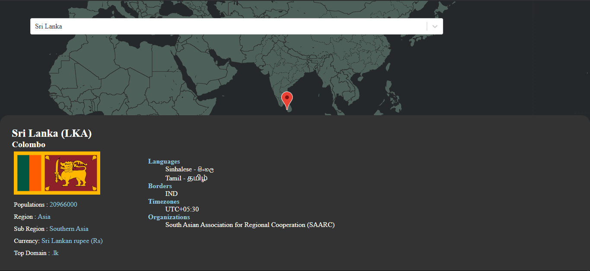

# Country Details Map

Get a Live [Demo](https://country-details-maps.netlify.app/)

## Tools Used - APIS

Get  [Rest Countries](https://restcountries.eu/)\
Get  [Geocode](https://developer.here.com/documentation/geocoder/dev_guide/topics/request-constructing.html)\
Get  [React Google Maps](https://www.npmjs.com/package/google-maps-react)

## Techolonogies

Reactjs & Hooks

## Screenshot

